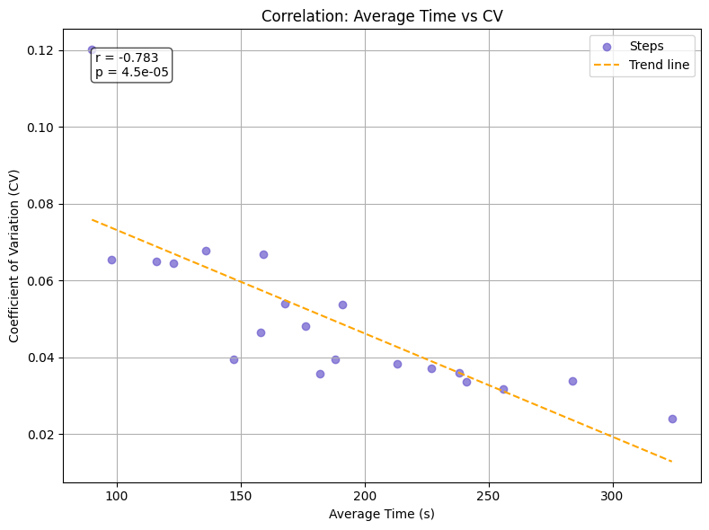

# Siemens Mobility Operations Industrial Engineer Simulation  

## Introduction  
This project replicates real-world tasks of an [**Operations Industrial Engineer**](https://www.theforage.com/simulations/siemens-mobility/operations-industrial-engineering-xh22) at Siemens Mobility as part of the *Project Velocity – Aurora Express* initiative.  

Siemens Mobility is a leading provider of transport solutions, continuously developing its portfolio in rolling stock, rail automation, electrification, turnkey systems, intelligent traffic systems, and related services. With digitalization, Siemens Mobility enables operators worldwide to build intelligent infrastructure, enhance sustainability, improve passenger experience, and ensure availability.  

During this simulation, I stepped into the role of an **Operations Industrial Engineer**, tasked with identifying inefficiencies and proposing improvements in the Aurora Express’s assembly line.  

---

## Task 1 — Time Study & Bottleneck Analysis  

### Background & Goal  
The team was tasked with identifying inefficiencies in the **Aurora Express assembly line**. Using time study data, the goal was to pinpoint bottlenecks and propose improvements to meet — and surpass — Siemens Mobility’s efficiency and sustainability benchmarks.

### Preliminary Analysis  
Before applying thresholds, an exploratory look revealed two categories of concern:  
- **Steps 6, 15, 20** → wider spreads, indicating higher variability.  
- **Steps 4, 14, 16** → consistently longer times, suggesting throughput bottlenecks.  

**Box Plot of Observed Times per Step**  
  
*Interpretation: Steps **6, 15, 20** show wider spreads (higher variability), while Steps **4, 14, 16** stand out as longer-duration tasks. This suggests two categories of potential bottlenecks: inconsistency-driven vs duration-driven.*

**Correlation Between Average Time and CV**  
  
*Interpretation: Strong negative correlation ($r = -0.783$, $p \approx 4.50 \times 10^{-5}$) — longer steps are more consistent, while shorter tasks fluctuate more, often depending on operator handling.*  

### Bottleneck Analysis  
Two metrics were applied with a strict **Mean + 2σ threshold**:  
- **Average Time (s):** flags duration-driven bottlenecks.  
- **Coefficient of Variation (CV):** flags inconsistency-driven bottlenecks, normalizing variability across tasks of different lengths.  

**Primary Time Bottleneck (Average Time, Mean + 2σ)**  
  
*Interpretation: Step 14 — Mount wheel to axle: highest average time, linked to crane use and heavy alignment.*  

**Primary Variability Bottleneck (CV, Mean + 2σ)**  
  
*Interpretation: Step 6 — Lubricate wheel bearings: high variability, likely due to inconsistent method or accessibility.*  

### Recommendation  
- **Step 14:** (Mount wheel to axle) → Initially proposed automation to reduce manual handling.  
- **Step 6:** (Lubricate wheel bearings) → Standardize lubrication tools/methods to improve consistency.  

---

## Task 2 — Layout Reconfiguration  

### Background & Goal  
Following Task 1, full automation for Step 14 was deemed **cost- and time-prohibitive**. Instead, the focus shifted to **reconfiguring the assembly line layout** to improve efficiency without expensive equipment investments.  

### Layout Comparison  

**Original Layout (Limitations):**  
- Tools not pre-positioned, causing repeated setup.  
- Inspection step inline, blocking downstream tasks.  
- Step 14 bottleneck due to unbalanced flow.  
- Harder for QA and supervisors to monitor.  

**Proposed Layout (Improvements):**  
- Convert to **assembly line process layout** with defined workstations.  
- Pre-position tools and small-parts stock at stations.  
- Separate inspection workstation to prevent blocking Step 4.  
- Group Steps 4–9 in the first station (longest block), balance flow to Step 14.  
- Add **“Assembled Product” area** to free workstations quickly.  

**Visuals:**  
   

| Aspect                | Original Layout                        | Proposed Layout                            |
|------------------------|-----------------------------------------|---------------------------------------------|
| Tools/Setup           | Repeated setup each cycle              | Pre-positioned tools, reduced setup         |
| Inspection            | Inline, blocking downstream            | Separate station, prevents delays           |
| Task Distribution     | Unbalanced, Step 14 bottleneck         | Balanced flow, Step 14 no longer bottleneck |
| Oversight             | Harder for QA/supervisors              | Easier monitoring, clear segmentation       |
| Throughput            | Slower, inconsistent                   | Faster, more consistent                     |

### Rationale & Benefits  
- **Efficiency Gains:** Reduced setup/waiting, streamlined flow.  
- **Workflow Stability:** Balanced stations eliminate bottlenecks.  
- **Improved Oversight:** Easier QA/supervision of processes.  
- **Sustainability:** Less wasted motion and waiting → long-term productivity.  

---

## Conclusion  
This project combined **data-driven analysis (Task 1)** with **practical process design (Task 2)** to address bottlenecks in the Aurora Express assembly line.  

- **Task 1:** Identified bottlenecks and variability using time study analysis.  
- **Task 2:** Proposed a feasible layout reconfiguration that relieves the Step 14 bottleneck without costly automation.  

By blending statistical insight with engineering design, this work demonstrates how industrial engineers can deliver both **efficiency** and **sustainability** in high-impact projects.  
